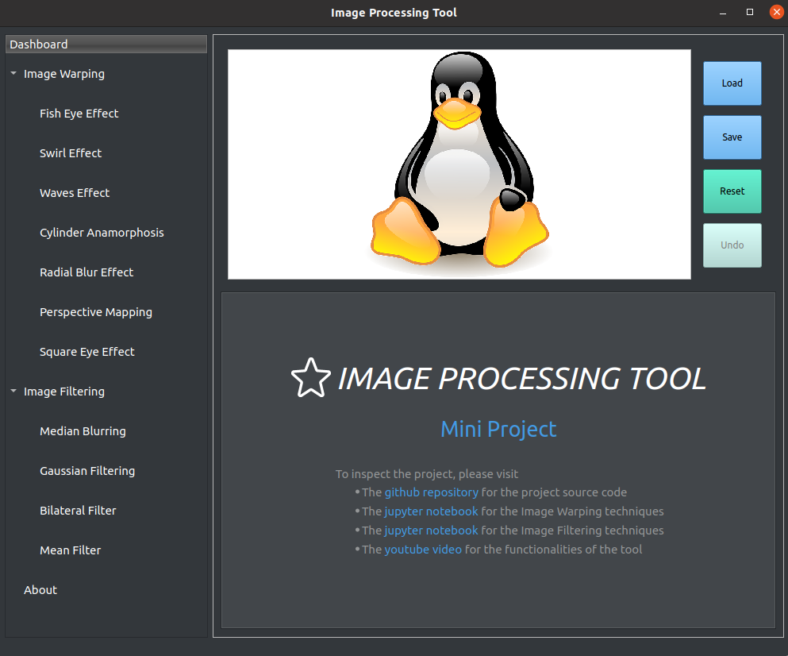

# Image Processing Tool (PySide6)

## Introduction

This project provides a user interface for image processing so that the user can make fun images by applying effects one after the other as they wish.

[Youtube video link](xx) for the demo of this project



## Features

- Model-view-controller 
- Implemented with PySide6 which is the newest version of Qt library for Python
- Threads used in order to increase the performance and prevent lags on the interface.
- Various image warping and image filtering methods implemented
- Undo applied effects on the images
- Saving the effects and undoing them

## Dependencies

- Ubuntu 20.04

```bash
$ sudo apt install python3-pip 
$ python -m pip install --upgrade pip
$ pip install -r requirements.txt
```


## Image Processing Methods

### Fish Eye Effect


### Swirl  Effect


### Waves Effect


### Cylinder Anamorphosis Effect


### Radial Blur Effect


### Perspective Mapping


### Square Eye Effect


### Median Blurring


### Gaussian Filtering


### Mean Filter


