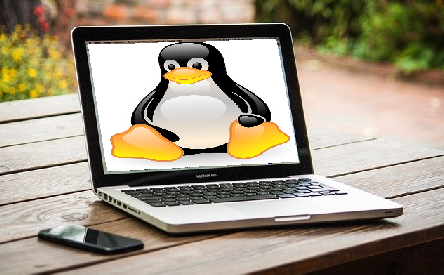

# Image Processing Tool (PySide6)


## Introduction

This project provides a Qt user interface for some image processing methods so that the user can play with these methods interactively. Also, I hope this project to be a reference for developers since there are not many PySide6 examples on the Internet right now. 

[Youtube video link](https://youtu.be/8llrNf-44yw) for the demo of this project: 

[](https://www.youtube.com/watch?v=8llrNf-44yw)


## Features

- Model-view-controller based design: `model.py`, `mainwindow.ui`, `controller.py` respectively.
- Used PySide6 which is the newest version of Qt library for Python.
- Multi-thread approach is used in order to increase the performance and prevent shuttering on the interface.
- Various image warping and image filtering methods are implemented.
- Applying multiple effects progressively and undo feature.

## Dependencies

- Tested on Ubuntu 20.04

```bash
$ sudo apt install python3.8 python3-pip python-is-python3
$ python -m pip install --upgrade pip
$ pip install -r requirements.txt
```

## Running

```bash
$ python controller.py
```


## Implemented Image Processing Methods

### Fish Eye Effect

Parameters: `x`, `y`, `sigma`


### Swirl  Effect

Parameters: `x`, `y`, `sigma`, `magnitute`


### Waves Effect

Parameters: `amplitute`, `frequency`, `phase`


### Cylinder Anamorphosis Effect

Parameters: `angle`


### Radial Blur Effect

Parameters: `sigma`


### Perspective Mapping

Parameters: `A second image for warping`, `x1`, `y1`, `x2`, `y2`, `x3`, `y3`, `x4`, `y4`




### Square Eye Effect

Parameters: `center x`, `center y`, `sigma`, `p value`


### Median Blurring

Parameters: `size`


### Gaussian Filtering

Parameters: `radius`


### Mean Filter

Parameters: `size`


